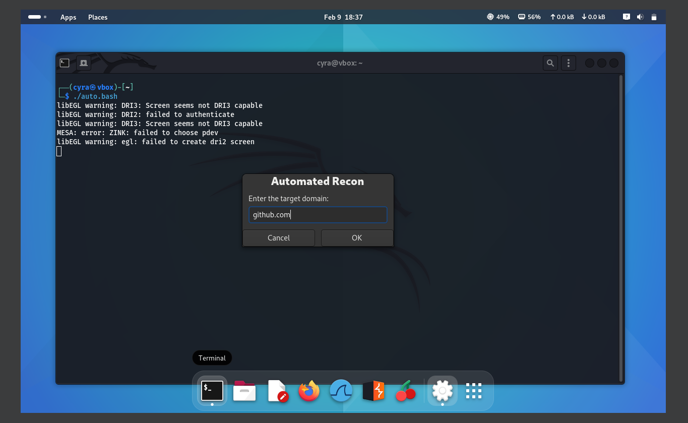
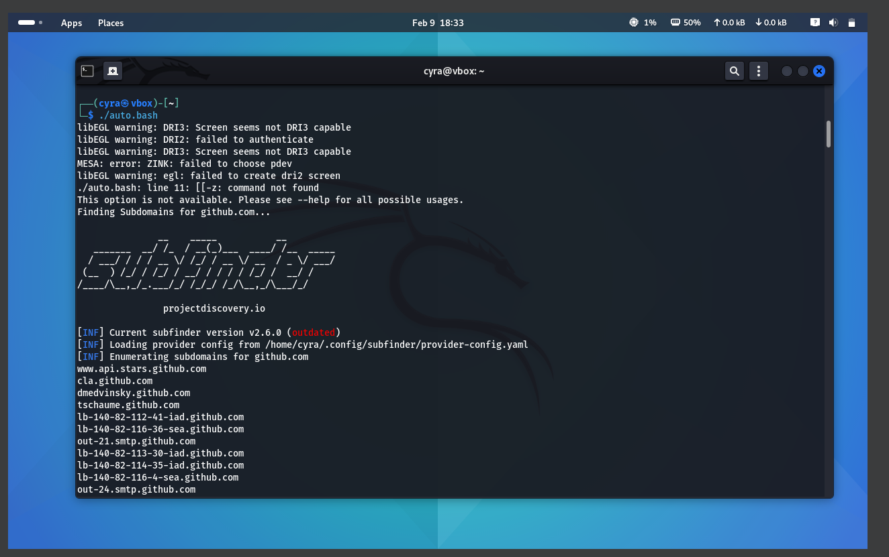
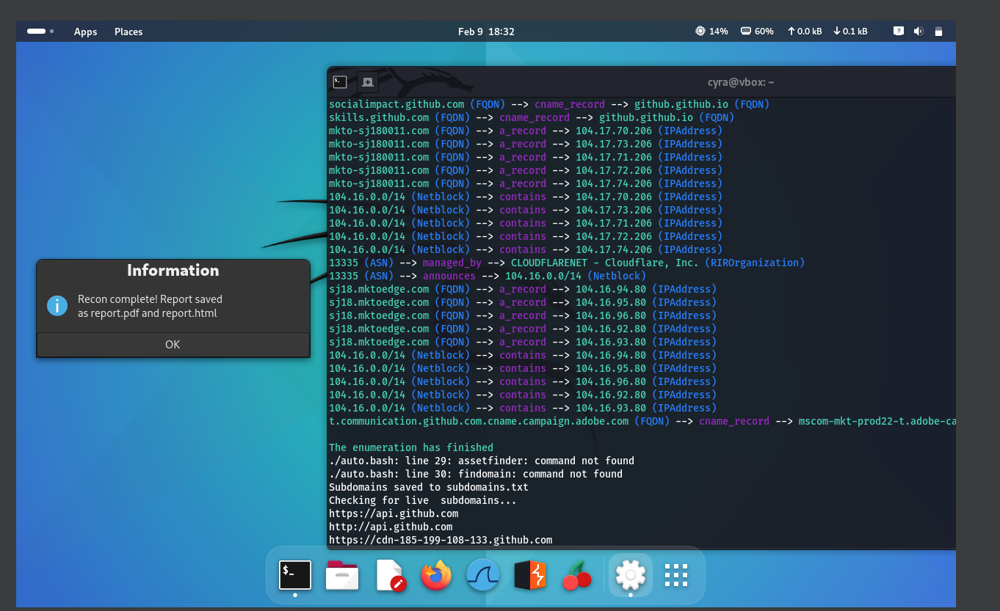

# Pentest Recon
## Overview  
This is a **Bash-based automated reconnaissance tool** that helps security researchers and penetration testers **find subdomains, check for live hosts, and generate a report** with an easy-to-use GUI.

## Features  
-  **Multi-tool Subdomain Enumeration** (`subfinder`, `amass`, `assetfinder`, `findomain`)  
-  **Live Subdomain Checking** (`httprobe`)  
-  **Report Generation in PDF & HTML** (`pandoc`)  
-  *Graphical User Interface (GUI)** (`Zenity`)  

## Installation  
### **1. Install Dependencies**
Before running the script, install the required tools:  
```bash
sudo apt update
sudo apt install -y subfinder amass assetfinder findomain httprobe pandoc zenity
```
### **2. Clone the Repository**
```bash
git clone https://github.com/yourusername/Automated-Recon-Script.git
cd Automated-Recon-Script
```
### **3. Make the Script Executable**
```bash
chmod +x recon.sh
```
### **4. Run the script**
```bash
./recon.sh
```
- The script will automatically find subdomains and check which ones are live.
- It will then generate a PDF and HTML report with the findings.

## Output Files
- 📄 subdomains.txt → List of found subdomains.
- 📄 live_subdomains.txt → List of active subdomains.
- 📄 report.pdf → Final PDF report.
- 📄 report.html → Final HTML report.

##  Screenshot  





## License
This project is licensed under the MIT License – feel free to use and modify it.

## Contributing
If you’d like to contribute, pull requests are welcome!
